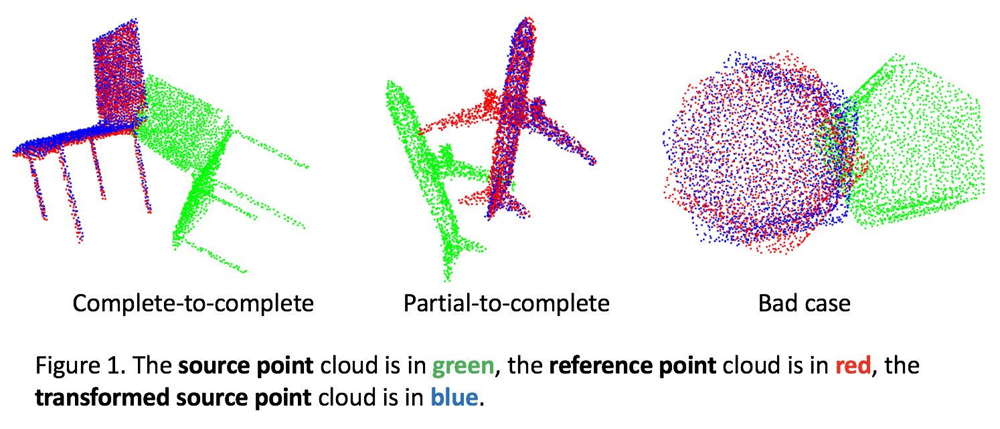

## Introduction

A Simple Point Cloud Registration Pipeline based on Deep Learning. Detailed Information Please Visit this [Zhihu Blog](https://zhuanlan.zhihu.com/p/289620126). 



## Install
- requirements.txt `pip install -r requirements.txt`
- open3d-python==0.9.0.0 `python -m pip install open3d==0.9`
- emd loss `cd loss/cuda/emd_torch & python setup.py install`


## Start
- Download data from [[here](https://shapenet.cs.stanford.edu/media/modelnet40_ply_hdf5_2048.zip), `435M`]
- evaluate and show(download the pretrained checkpoint [[Complete](https://pan.baidu.com/s/1L7fdgMAHYSDEbCNwLM1Crg), **pwd**: `c4z7`, `16.09 M`] or [[Paritial](https://pan.baidu.com/s/1b1kRlKsxqmUwZZ7XJmcK4w), **pwd**: `pcno`, `16.09`]  first)

    ```
    # Iterative Benchmark
    python modelnet40_evaluate.py --root your_data_path/modelnet40_ply_hdf5_2048 --checkpoint your_ckpt_path/test_min_loss.pth --cuda
    
    # Visualization
    # python modelnet40_evaluate.py --root your_data_path/modelnet40_ply_hdf5_2048 --checkpoint your_ckpt_path/test_min_loss.pth  --show
    
    # ICP
    # python modelnet40_evaluate.py --root your_data_path/modelnet40_ply_hdf5_2048 --method icp
    
    # FGR
    # python modelnet40_evaluate.py --root your_data_path/modelnet40_ply_hdf5_2048 --method fgr --normal

    ```

- train
    
    ```
    CUDA_VISIBLE_DEVICES=0 python modelnet40_train.py --root your_data_path/modelnet40_ply_hdf5_2048
    ```

## Experiments

- Point-to-Point Correspondences(**R error is large due to EMDLoss, see [here](https://zhuanlan.zhihu.com/p/289620126)**)

| Method | isotropic R | isotropic t | anisotropic R(mse, mae) | anisotropic t(mse, mae) | time(s) |
| :---: | :---: | :---: | :---: | :---: | :---: |
| ICP | 11.44 | 0.16 | 17.64(5.48) | 0.22(0.07) | 0.07 |
| **FGR** | **0.01** | **0.00** | **0.07(0.00)** | **0.00(0.00)** | 0.19 |
| IBenchmark | 5.68 | 0.07 | 9.77(2.69) | 0.12(0.03) | **0.022** |
| **IBenchmark + ICP** | 3.65 | 0.04 | 9.22(1.66) | 0.11(0.02) |  |

- Noise Data(infer_npts = 1024)

| Method | isotropic R | isotropic t | anisotropic R(mse, mae) | anisotropic t(mse, mae) |
| :---: | :---: | :---: | :---: | :---: |
| ICP | 12.14 | 0.17 | 18.32(5.86) | 0.23(0.08) |
| FGR | **4.27** | **0.06** | 11.55(2.43) | **0.09(0.03)** | 
| IBenchmark | 6.25 | 0.08 | 9.28(2.94) | 0.12(0.04) |
| **IBenchmark + ICP** | 5.10 | 0.07 | **10.51(2.39)** | 0.13(0.03) |  |

- Partial-to-Complete Registration(infer_npts = 1024)

| Method | isotropic R | isotropic t | anisotropic R(mse, mae) | anisotropic t(mse, mae) |
| :---: | :---: | :---: | :---: | :---: |
| ICP | 21.33 | 0.32 | 22.83(10.51) | 0.31(0.15) |
| FGR | 9.49 | **0.12** | 19.51(5.58) | **0.17(0.06)** |
| IBenchmark | 15.02 | 0.22 | 15.78(7.45) | 0.21(0.10) | 
| **IBenchmark + ICP** | **9.21** | 0.13 | **14.73(4.43)** | 0.18(0.06) |  |

**Note**: 
- Detailed metrics information please refer to [RPM-Net](https://arxiv.org/pdf/2003.13479.pdf)[CVPR 2020].

## Train your Own Data
- Prepare the data in the following structure
    ```
    |- CustomData(dir)
        |- train_data(dir)
            - train1.pcd
            - train2.pcd
            - ...
        |- val_data(dir)
            - val1.pcd
            - val2.pcd
            - ...
    ```
- Train
    ```
    python custom_train.py --root your_datapath/CustomData --train_npts 2048 
    # Note: train_npts depends on your dataset
    ```
- Evaluate
    ```
    # Evaluate, infer_npts depends on your dataset
    python custom_evaluate.py --root your_datapath/CustomData --infer_npts 2048 --checkpoint work_dirs/models/checkpoints/test_min_loss.pth --cuda
    
    # Visualize, infer_npts depends on your dataset
    python custom_evaluate.py --root your_datapath/CustomData --infer_npts 2048 --checkpoint work_dirs/models/checkpoints/test_min_loss.pth --show
    ```

## Acknowledgements

Thanks for the open source [code](https://github.com/vinits5/pcrnet_pytorch) for helping me to train the Point Cloud Registration Network successfully.